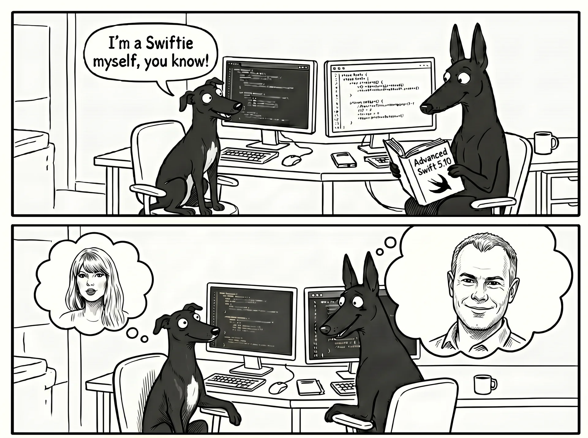

# Thinking in Swift

Welcome to Swift. If you are coming from JavaScript and React like me, this guide will help you translate your web development knowledge into iOS development. 

## What is Swift?

Swift is Apple's primary programming language for building iOS applications. 

###### Key facts about Swift:
- **Introduced:** 2014 by Apple.
- **Purpose:** To replace Objective-C with a safer, faster, and more modern language.
- **Creator:** Chris Lattner. He previously built LLVM, which is the compiler infrastructure that now powers Swift.



## Why was it built?

Before 2014, developers used Objective-C to build Apple apps using the Cocoa and Cocoa Touch frameworks. Objective-C was powerful but had a complicated syntax. Swift was designed to be cleaner and safer while maintaining full compatibility with the older Objective-C codebases.

#### Comparison of how you display "Hello, World!" in C, Swift and React.

**How it looked in Objective-C (before 2014):**
```objective-c
#import <UIKit/UIKit.h>

@interface ViewController : UIViewController
@end

@implementation ViewController

- (void)viewDidLoad {
    [super viewDidLoad];
    
    UILabel *label = [[UILabel alloc] init];
    label.text = @"Hello, World!";
    [label sizeToFit];
    label.center = self.view.center;
    
    [self.view addSubview:label];
}

@end
```

**How it looks now in Swift (specifically using SwiftUI):**
```swift
import SwiftUI

struct ContentView: View {
    var body: some View {
        Text("Hello, World!")
    }
}
```

**How that same concept looks in React (JavaScript):**
```javascript
import React from 'react';

export default function App() {
  return (
    <div style={{ display: 'flex', justifyContent: 'center', alignItems: 'center', height: '100vh' }}>
      <h1>Hello, World!</h1>
    </div>
  );
}
```

- Note the styling in Swift is inbuilt, whereas in React everything is unstyled by default.

## Two Core Concepts of Swift

When transitioning from JavaScript to Swift thinking, these are the two most important differences to understand: 

### 1. Swift is Object and Protocol-Oriented

::: {.callout-important}
#### Everything in Swift is an object.

Basic data types like integers, strings, and booleans are fully functioning objects with their own properties and methods, unlike the primitive types found in JavaScript.

```swift
let age = 30 // age is an object. 

// We can call methods directly on it:
let isMultiple = age.isMultiple(of: 5) // returns true
```
:::

**Why is Swift designed this way?**

<iframe width="560" height="315" src="https://www.youtube.com/embed/8nyg_IXfnvs?si=1bhxAc7ONEEwxOgW" title="YouTube video player" frameborder="0" allow="accelerometer; autoplay; clipboard-write; encrypted-media; gyroscope; picture-in-picture; web-share" referrerpolicy="strict-origin-when-cross-origin" allowfullscreen></iframe>

> **So much of computing is about defining mutable state and managing it**. Functional programming says 'cool, you can do that...' and the way it does that is making an entire copy of the data structure with the changes and then you copy the data struture - this is generally what people mean by functional programming; although you could define it in multiple different ways. Purely functional means there is **no in-place mutation**. Here's a problem...computers are all bags of mutabale state. So if you saying you're going to re-allocate and copy the entire data structure to make a change somewhere in the tree...it's just extremely slow. - Chris Lattner

- **Interoperability:** The original Apple frameworks (Cocoa Touch) were built strictly on Object-Oriented Programming (OOP) paradigms. Swift needed to seamlessly interoperate with this massive existing ecosystem.
- **Protocol-Oriented Programming:** Swift expands on traditional OOP. Instead of focusing only on what objects *are* (via inheritance), Swift places a heavy emphasis on what objects *can do* using Protocols (similar to Interfaces in TypeScript).

### 2. Swift is Strongly and Statically Typed

::: {.callout-important}
#### Everything in Swift has a specific type.

The compiler enforces these types before the app can run.

```swift
var name = "Charlotte" // The compiler infers this is a String

name = 42  // The compiler immediately flags this as an error before the app ever runs
```
:::

**Type Inference:** Swift's compiler automatically figures out the type of a variable based on its initial value. This gives you the safety of strict types without the need to manually declare them every time.

{fig-align="center"}

**How this differs from JavaScript and TypeScript:**

- **JavaScript:** You can dynamically change a variable from a number to a string. Type errors are only caught at runtime (when the user is using the app), which can cause crashes.
- **TypeScript:** TypeScript adds a compile-time type checker on top of JavaScript and uses the exact same philosophy as Swift here. The compiler will flag `name = 42` as an error before the code runs. The key difference is that TypeScript compiles *down to JavaScript* — it still ships interpreted JS to the browser.

  -  **Swift compiles to native machine code — a fundamentally different runtime from TypeScript's interpreted JavaScript, and a significantly faster one.**


- **Swift:** Type errors are caught at compile-time (while you are writing the code). You cannot compile or run the app until type errors are fixed. This drastically reduces bugs in production.


### The Compile Cycle: What happens when you hit build?

**Fact:** Swift compiles directly down to native machine code (binary). Unlike React, which is shipped as raw text (JavaScript) to be read and interpreted by a user's web browser at runtime, an iOS app is fully "pre-baked" before it ever leaves your computer.

**The Build Process (Step-by-step):**

1. **You write `.swift` code** (Human readable logic).
2. **LLVM Compiler engages.** It strictly checks for type-errors, missing variables, or syntactic anomalies. If it finds even one error, the build forcibly halts.
3. **Translation into Machine Code.** If your code passes all checks, LLVM translates your logic directly into highly optimized 1s and 0s (ARM Machine Code) specifically tailored for an iPhone's processor.
4. **Packaging into an `.ipa`.** This compiled binary, alongside your images and configuration files, is securely zipped into an `.ipa` (iOS App Store Package) file.


```
hello world in Swift

```

```
after LLVM compilation in Swift

```


**What actually ships to the App Store?**

- You do **not** ship your raw source code.
- You ship the finalized, fully compiled `.ipa` binary package.
- **Why this matters for your users:** Because the app arrives on their physical phone already translated into raw machine code, it opens and runs blazingly fast compared to a web browser downloading and parsing a heavy JavaScript bundle.

## Comparing Swift & SwiftUI to JavaScript & React

Here is a direct mapping of concepts between the two ecosystems.

| Concept | Swift & SwiftUI | JavaScript & React |
| :--- | :--- | :--- |
| **Language Paradigm** | Strongly typed, Protocol-Oriented | Dynamically typed, Functional/Prototype-based |
| **Execution** | Compiled directly to machine code | Interpreted / JIT compiled by the browser |
| **Error Checking** | Caught at compile-time | Caught at runtime (unless using TypeScript) |
| **Core UI Component** | `View` structs | React Components (Functions returning JSX) |
| **Syntax Style** | Declarative Swift | Declarative JSX |
| **Local Component State** | `@State private var count = 0` | `const [count, setCount] = useState(0)` |
| **Passing State (Props)** | `let title: String` or `@Binding` | Component `props` |
| **Global State** | `@EnvironmentObject` or `@Observable` | Context API, Redux, or Zustand |