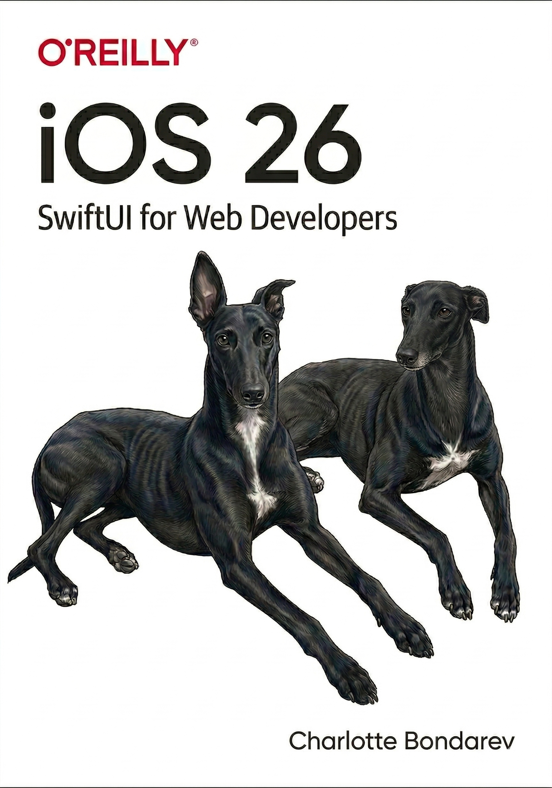

# Preface {.unnumbered}

::: {.column-margin}

:::

This is a book aimed at others on a similar journey of specialisation in Swift - from the world of React and web development. 

This book assumes the reader has some programming experience and does not explain basics

::: {.callout-important}
This is ***not** a legitimate Oreilly publishing, I **hope it is one day**.
:::

Writing this book as I ask AI to explain concepts to me, and making a shareable resource in the process

The dogs on the cover are Annie and Anubis they are adopted Greyhounds, recommend this breed to any software engineer wanting dogs - they are couch potatoes and will not bother you while you code.

This is dedicated to my wonderful partner Alex; who showed me the world of software engineering and gave me the power to build anything I could dream of. Thankyou for believing in me, and pushing me to learn to code. You were right, it rocks.